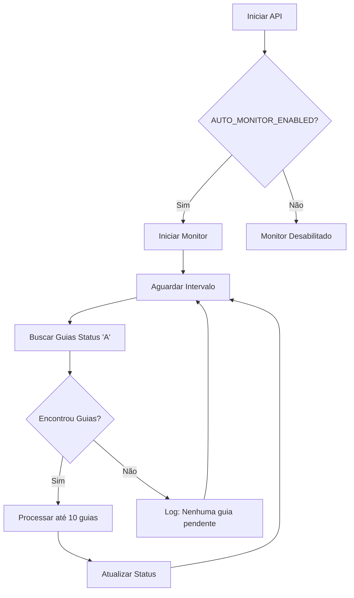

# 🤖 Monitoramento Automático - Sistema DRG

## 📋 Visão Geral

O sistema de monitoramento automático verifica periodicamente a tabela `inovemed_tbl_guias` em busca de guias com status "A" (Aguardando) e as processa automaticamente enviando para a API DRG.

## ⚙️ Configuração

### Variáveis de Ambiente

```bash
# Monitoramento automático
AUTO_MONITOR_ENABLED=True          # Habilitar/desabilitar monitoramento
MONITOR_INTERVAL_MINUTES=5         # Intervalo entre verificações (minutos)
```

### Valores Recomendados

- **Desenvolvimento**: `5-10 minutos`
- **Homologação**: `2-5 minutos`
- **Produção**: `1-3 minutos`

## 🔄 Como Funciona

### 1. Inicialização

- Monitoramento inicia automaticamente quando a API sobe
- Verifica se `AUTO_MONITOR_ENABLED=True`
- Se `MONITOR_INTERVAL_MINUTES=0`, monitoramento fica desabilitado

### 2. Ciclo de Monitoramento



### 3. Processamento de Guias

Para cada guia encontrada:

1. **Status → "P"** (Processando)
2. **Incrementar** contador de tentativas
3. **Enviar** para API DRG
4. **Atualizar Status**:
   - ✅ **Sucesso** → "T" (Transmitida)
   - ❌ **Erro** → "E" (Erro) + mensagem de erro

## 🎛️ Controle via API

### Ver Status do Monitoramento

```http
GET /api/v1/monitoramento/status
```

**Resposta:**

```json
{
  "success": true,
  "data": {
    "monitoramento_ativo": true,
    "intervalo_minutos": 5,
    "auto_monitor_enabled": true,
    "total_guias": 25,
    "aguardando": 3,
    "processando": 1,
    "transmitidas": 20,
    "com_erro": 1,
    "ultima_verificacao": "2024-01-15T10:30:00"
  }
}
```

### Iniciar Monitoramento

```http
POST /api/v1/monitoramento/start
```

**Resposta:**

```json
{
  "success": true,
  "message": "Monitoramento iniciado com sucesso",
  "timestamp": "2024-01-15T10:30:00"
}
```

### Parar Monitoramento

```http
POST /api/v1/monitoramento/stop
```

**Resposta:**

```json
{
  "success": true,
  "message": "Monitoramento parado com sucesso",
  "timestamp": "2024-01-15T10:30:00"
}
```

## 📊 Logs de Monitoramento

### Localização

- **Arquivo**: `logs/drg_guias.log`
- **Nível**: INFO/DEBUG

### Tipos de Log

#### 🚀 Início do Monitoramento

```
2024-01-15 10:00:00 - drg_integration - INFO - 🚀 Iniciando monitoramento automático (intervalo: 5 min)
```

#### 📋 Ciclo de Verificação

```
2024-01-15 10:05:00 - drg_integration - INFO - 📋 Encontradas 3 guias pendentes
```

#### 🔄 Processamento Individual

```
2024-01-15 10:05:01 - drg_integration - INFO - 🔄 Processando guia 123456 (ID: 1)
2024-01-15 10:05:02 - drg_integration - INFO - ✅ Guia 123456 processada com sucesso
```

#### ❌ Erros

```
2024-01-15 10:05:03 - drg_integration - ERROR - ❌ Erro ao processar guia 123457: Token expirado
```

## 🧪 Testando o Monitoramento

### Script de Teste

```bash
# Executar script de teste
python testar_monitoramento.py
```

**Menu disponível:**

1. Ver status do monitoramento
2. Testar controle (parar/iniciar)
3. Monitorar em tempo real
4. Teste completo

### Teste Manual

```bash
# 1. Ver status atual
curl "http://localhost:8000/api/v1/monitoramento/status"

# 2. Parar monitoramento
curl -X POST "http://localhost:8000/api/v1/monitoramento/stop"

# 3. Iniciar monitoramento
curl -X POST "http://localhost:8000/api/v1/monitoramento/start"

# 4. Verificar novamente
curl "http://localhost:8000/api/v1/monitoramento/status"
```

## 🔧 Configurações Avançadas

### Desabilitar Monitoramento

```bash
# No .env
AUTO_MONITOR_ENABLED=False
```

### Monitoramento Mais Frequente

```bash
# Verificar a cada 1 minuto
MONITOR_INTERVAL_MINUTES=1
```

### Monitoramento Menos Frequente

```bash
# Verificar a cada 15 minutos
MONITOR_INTERVAL_MINUTES=15
```

## 🚨 Solução de Problemas

### Monitoramento Não Inicia

1. **Verificar logs**: `tail -f logs/drg_guias.log`
2. **Verificar .env**: `AUTO_MONITOR_ENABLED=True`
3. **Verificar intervalo**: `MONITOR_INTERVAL_MINUTES > 0`

### Guias Não São Processadas

1. **Verificar status**: `GET /api/v1/monitoramento/status`
2. **Verificar logs**: Buscar por "📋 Encontradas"
3. **Verificar conexão DRG**: `GET /api/v1/drg/status`

### Monitoramento Para Inesperadamente

1. **Verificar logs de erro**: Buscar por "❌"
2. **Verificar recursos**: CPU/Memória
3. **Reiniciar API**: `uvicorn main:app --reload`

## 📈 Monitoramento em Produção

### Recomendações

1. **Intervalo**: 1-3 minutos para produção
2. **Logs**: Configurar rotação de logs
3. **Monitoramento**: Usar ferramentas como Prometheus/Grafana
4. **Alertas**: Configurar alertas para falhas consecutivas

### Métricas Importantes

- **Taxa de sucesso** de processamento
- **Tempo médio** de processamento
- **Número de tentativas** por guia
- **Uptime** do monitoramento

## 🔄 Integração com Sistema de Alertas

### Webhooks (Futuro)

```json
{
  "event": "guia_processada",
  "guia_id": 123,
  "status": "sucesso",
  "timestamp": "2024-01-15T10:30:00"
}
```

### Notificações (Futuro)

- **Email** para erros críticos
- **Slack** para status diário
- **SMS** para falhas de sistema


